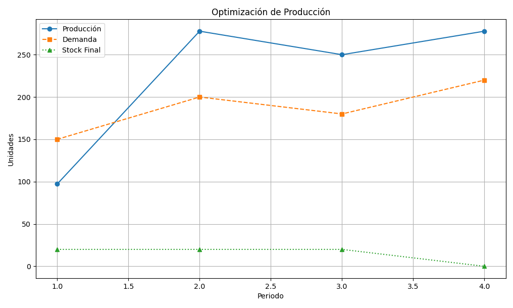

# Hackaton Micron Team Linealytics
  Track:Micron  Team:Linealytics

### Objetivo Pricipal:

Crear un sistema con Python junto con el ecosistema empresarial de Microsoft, para automatizar los cálculos necesarios para equilibrar la producción con la demanda, permitiendo una planificación más precisa y eficiente y reduciendo los costes, mediante un modelo de XGBoost, Bootstrapping y un sistema de programación lineal.

###  Criterios Principales:

Optimizar el plan de producción mediante programación lineal para satisfacer la demanda minimizando la productividad,teniendo en cuenta el rendimiento, la densidad, el stock de seguridad y un stock objetivo final de cero.Args:initial_stock (float): El nivel de stock inicial.demands (lista de float): La demanda para cada periodo.yield_percentage (float): El porcentaje de rendimiento (0 a 1).density (float): El factor de densidad de producción.max_productivity (float): La productividad máxima por periodo.safety_stocks (lista de float, opcional): El stock de seguridad para cada periodo.Si None, no se aplica ninguna restricción de stock de seguridad.  Debe tener la misma longitud que las demandas si se proporciona.Devuelve:dict: La productividad total óptima.- 'production_levels': Una lista de los niveles óptimos de producción para cada período.- 'ending_stocks': Una lista de los niveles de existencias finales para cada período.- 'status': El estado de la optimización ('Óptimo', 'Inviable', etc.).

## Arquitectura

### Host:

Azure

### Data:

CSV (Datos Historicos) -> Trasponer -> Conversion de trimestres a registros Semanales -> CSV con datos limpios y en el formato mas granulado

### BackEnd:

CSV con datos limpios y en el formato mas granulado -> XGBoost -> Bootstrapping -> Programacion Lineal - > CSV Predicciones y punto de Equilibrio
    

### FrontEnd:

CSV Predicciones + CSV punto de Equilibrio -> PowerBI -> Reporte financiero para ejecutivos

### Automatizacion con Microsoft Power Automate

Iterar el proceso de manera continua y sin interrupcion

1.- Data
2.- BackEnd
3.- FrontEnd

### Notificaciones Via Mail.
Agregar Top Loss o un equivalencia para poder automatizar la notificacion en casos concretos como por ejemplo cuando el modelo detecte sobreproduccion o ruptura de Stock, Reportes semanales de PowerBI, etc. 

### Copilot:

Uso de lenguaje natural para usuarios finales, y que pueden hacer preguntas acerca de los data sets o exceles, PowerBI, etc
