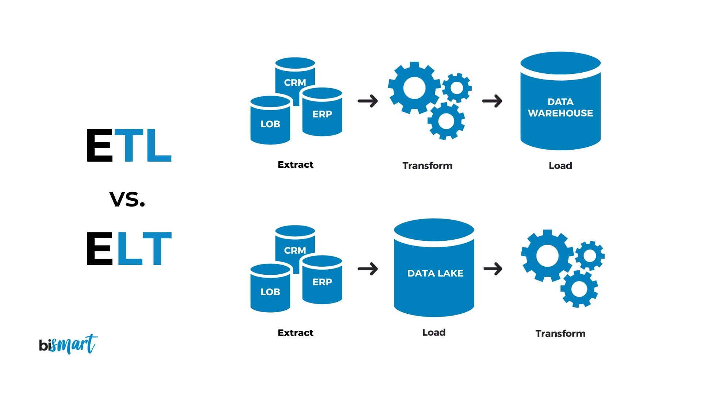

# 📊 Linealytics AutoProduction

  

---

## 📌 Introducción

Este proyecto fue desarrollado para el **Genius Arena Hackathon 2025** de **Talent Land**, dentro del track *"Production Planning Linear Programming"* presentado por **Micron**. Fue creado por el equipo **Linealytics**, el cual se posicionó entre los tres finalistas del evento.

El sistema fue construido en Python, integrando el ecosistema empresarial de Microsoft para automatizar los cálculos necesarios que equilibran la producción con la demanda. Esto permite una planificación más precisa y eficiente, así como una reducción de costos, mediante un modelo basado en **XGBoost**, **Bootstrapping** y **programación lineal**.

---

## ✅ Objetivo Principal

> **System in Python that automates the necessary calculations to balance production with demand, allowing more precise and efficient planning and reducing costs, using linear programming modeling.**

---

## 🎯 Criterios Principales

El sistema tiene como objetivo **minimizar la productividad** requerida para satisfacer la demanda, considerando:

* Stock inicial
* Rendimiento
* Productividad máxima
* Densidad de producción
* Stock final objetivo: **cero**
* Stock de seguridad (opcional)

---

## 🚀 Desarrollo

El desarrollo del sistema incluyó diversas tecnologías y metodologías para lograr un flujo de trabajo automatizado e inteligente:

* ☁️ Despliegue y orquestación en la nube con **Microsoft Azure**
* 🧠 Predicción semanal de demanda mediante **XGBoost**
* 🎲 Simulación de escenarios usando **Bootstrapping**
* 🧮 Optimización a través de **Programación Lineal**
* 📈 Visualización interactiva con **Power BI**
* ⚙️ Automatización del flujo de trabajo con **Microsoft Power Automate**
* 📧 Notificaciones inteligentes por correo electrónico **Microsoft Power Automate**
* 💬 Interacción mediante lenguaje natural con **Microsoft Copilot**

   
  <i>XGBoost</i>

   
  <i>Bootstrapping</i>

---

## 🧩 Metodologías Utilizadas

Para asegurar un desarrollo colaborativo, ágil y estructurado, se emplearon las siguientes metodologías:

   
  <i>SCRUM</i>

   
  <i>CRISP-DM</i>

---

## ⚙️ Tecnologías Utilizadas

A continuación, se enlistan las principales tecnologías utilizadas:

* **Hosting:** Microsoft Azure
* **Backend:** Python
* **Frontend:** Power BI
* **Automatización:** Microsoft Power Automate
* **IA Conversacional:** Microsoft Copilot

---

## 🏗️ Arquitectura General

El sistema está desplegado en Microsoft Azure bajo una arquitectura modular y escalable que integra analítica avanzada, automatización e inteligencia artificial. Incluye servicios como Microsoft Power Automate, Excel, y Power BI Embedded, asegurando alto rendimiento y disponibilidad.

La potencial integración nativa con **SAP ERP** permite automatizar la toma de decisiones sobre datos reales del negocio, mejorando la eficiencia operativa. Gracias a su diseño serverless, puede escalar fácilmente a nivel corporativo con mínimo mantenimiento.

   
  <i>Arquitectura en Azure</i>

   
  <i>Integración con SAP</i>

---

## 🔍 Análisis Exploratorio y Preprocesamiento

Dada la naturaleza de los datos, se optó por un enfoque **EDA (Exploratory Data Analysis)** sobre ETL o ELT. Este permitió:

* Exploración detallada de los datos
* Conversión de trimestres a semanas
* Transformaciones previas al modelado

  
   <i>ETL vs ELT</i>

  
  
   <i>Análisis Exploratorio</i>

---

## 🔁 Flujo de Trabajo Automatizado

Gracias a **Microsoft Power Automate**, el sistema implementa un flujo completamente automatizado que ejecuta los siguientes pasos:

* 📥 Extracción de datos desde Excel
* 🔄 Conversión a registros semanales
* 🧠 Predicción con **XGBoost**
* 🎲 Simulación de escenarios
* 🧮 Optimización lineal
* 📊 Visualización en Power BI
* 📧 Envío de notificaciones por correo

   
  <i>Flujo automatizado con Power Automate</i>

---

## 📬 Notificaciones Inteligentes

Se configuraron alertas automatizadas por correo electrónico para situaciones críticas como:

* Reportes semanales automáticos
* Ruptura de stock
* Sobreproducción

  
  
  
  
   <i>Alertas automatizadas por correo</i>

---

## 📊 Visualización y Análisis de Datos

Para garantizar una visualización comprensible para personal no técnico, como ejecutivos o administradores, se optó por utilizar **Power BI** para la presentación de resultados clave.

  
   <i>Resultados del Modelo Programación Lineal en Python</i>

  
  
   <i>Dashboards interactivos en Power BI</i>

---

## 🗣️ Interacción con Microsoft Copilot

**Microsoft Copilot** permite una experiencia de usuario intuitiva mediante lenguaje natural. Entre sus funciones destacadas se encuentran:

* Realización de consultas sobre datos en Power BI y Excel
* Acceso simplificado para usuarios sin conocimientos técnicos

---

## ✅ Conclusión

Este proyecto me ha permitido adquirir una visión más profunda sobre el despliegue de soluciones de **Data Science** en entornos empresariales productivos. Aprendí a integrar técnicas avanzadas de análisis, predicción y automatización, combinadas con herramientas de visualización e interacción accesibles para todo tipo de usuarios.

---
