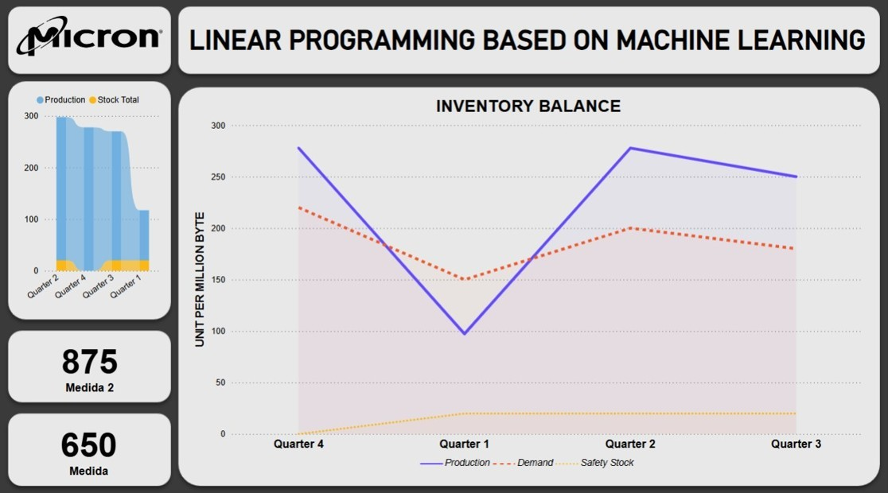

# 📊 Linealytics AutoProduction

  

---

## 📌 Introducción

Este proyecto fue desarrollado para el **Genius Arena Hackathon 2025** de **Talent Land**, dentro del track *"Production Planning Linear Programming"* presentado por **Micron**. Fue creado por el equipo **Linealytics**, el cual se posicionó entre los tres finalistas del evento.

Este proyecto adopta un enfoque integral de Machine Learning Ops, implementado en Azure y desarrollado con Python, aprovechando el ecosistema empresarial de Microsoft para orquestar y automatizar los cálculos que equilibran la producción con la demanda. 

Esto permite una planificación más precisa y eficiente, así como una reducción de costos, mediante un modelo de Machine Learning basado en **XGBoost**, **Bootstrapping** y **Programación Lineal** dentro de un pipeline robusto, se consigue una planificación más precisa, eficiente y de bajo costo, con trazabilidad y escalabilidad desde el desarrollo hasta producción.

---

## ✅ Objetivo Principal

> **System in Python that automates the necessary calculations to balance production with demand, allowing more precise and efficient planning and reducing costs, using linear programming modeling.**

---

## 🎯 Criterios Principales

El sistema tiene como objetivo **minimizar la productividad** requerida para satisfacer la demanda, considerando:

* Stock inicial
* Rendimiento
* Productividad máxima
* Densidad de producción
* Stock final objetivo: **cero**
* Stock de seguridad (opcional)

---

## 🚀 Desarrollo

El desarrollo del sistema integró diversas tecnologías, metodologías, y prácticas orientadas a **Machine Learning Ops** con el objetivo de lograr un flujo de trabajo automatizado, reproducible, e inteligente, con un enfoque iterativo y colaborativo.

* ☁️ Despliegue y orquestación en la nube con **Microsoft Azure**
* 📊 Pipeline de datos para la extracción, y limpieza **Python**
* 🧠 Predicción semanal de demanda mediante **XGBoost**
* 🎲 Simulación de escenarios usando **Bootstrapping**
* 🧮 Optimización a través de **Programación Lineal**
* 📈 Visualización interactiva con **Power BI**
* ⚙️ Automatización del flujo de trabajo con **Microsoft Power Automate**
* 📧 Notificaciones inteligentes por correo electrónico **Microsoft Power Automate**
* 💬 Interacción mediante lenguaje natural con **Microsoft Copilot**

   
  <i>XGBoost</i>

   
  <i>Bootstrapping</i>

---

## 🧩 Metodologías Utilizadas

Para asegurar un desarrollo colaborativo, ágil y estructurado, se emplearon las siguientes metodologías:

   
  <i>SCRUM</i>

   
  <i>CRISP-DM</i>

---

## ⚙️ Tecnologías Utilizadas

A continuación, se enlistan las principales tecnologías utilizadas:

* **Hosting:** Microsoft Azure
* **Backend:** Python
* **Frontend:** Power BI
* **Automatización:** Microsoft Power Automate
* **IA Conversacional:** Microsoft Copilot

---

## 🔧 Proceso de Machine Learning Ops

Uno de los pilares fundamentales de este sistema es la implementación de un ciclo de vida completo de **Machine Learning Ops (MLOps)**. A través del uso de **Azure Machine Learning**, **GitHub Actions** y principios de CI/CD, se logró una solución reproducible, mantenible y alineada con estándares empresariales.

El pipeline automatizado abarca:

* 📦 **Versionado de datos y modelos** mediante herramientas como **MLflow**, asegurando trazabilidad completa.
* 🧪 **Validación continua** de calidad de datos y rendimiento de modelos antes del despliegue.
* 🚀 **Entrega continua** de modelos a entornos productivos mediante endpoints de inferencia desplegados en Azure.
* 📊 **Monitoreo en producción**, recolección de métricas en tiempo real y alertas automáticas ante drifts o errores.
* 🔁 **Retraining automatizado** a partir de condiciones predefinidas, cerrando el ciclo de mejora continua.

Esta capa de MLOps permite reducir riesgos, garantizar confiabilidad y acelerar el tiempo de valor de los modelos predictivos.

---

## 🏗️ Arquitectura General

El sistema se encuentra desplegado sobre la infraestructura de Microsoft Azure, aprovechando una arquitectura modular, desacoplada y altamente escalable, diseñada bajo los principios fundamentales de Machine Learning Ops (MLOps). Esta arquitectura permite no solo la ejecución de modelos de aprendizaje automático en entornos productivos, sino también su integración continua, monitoreo, trazabilidad y mantenimiento a lo largo de todo su ciclo de vida.

Uno de los pilares centrales de esta arquitectura es la orquestación de pipelines de Machine Learning mediante Azure Machine Learning, donde cada etapa del flujo desde la ingesta de datos hasta el despliegue del modelo se encuentra automatizada y versionada. La arquitectura permite registrar datasets, trackear experimentos, almacenar modelos con control de versiones y realizar validaciones automáticas antes de su paso a producción. Esto garantiza reproducibilidad, calidad y gobernanza de los procesos de ciencia de datos.

En complemento, se utilizan servicios como Microsoft Power Automate para gestionar la automatización de tareas críticas como la activación programada de flujos de predicción, notificación de resultados, generación de reportes y retroalimentación con sistemas externos. La capa de visualización está cubierta por Power BI Embedded, lo que permite ofrecer tableros dinámicos y seguros a usuarios finales sin conocimientos técnicos, integrados de forma nativa con los resultados de los modelos.

El sistema también integra flujos de entrada de datos mediante Excel y otros orígenes on-premise o en la nube, los cuales son transformados y validados automáticamente mediante scripts de preprocesamiento definidos como módulos reutilizables. Esta flexibilidad permite adaptar el sistema a distintos contextos productivos sin necesidad de rediseñar la arquitectura base.

Gracias al diseño Serverless, los recursos se escalan automáticamente según la demanda, optimizando el uso de la infraestructura sin requerir intervención manual. Esta característica, junto con el desacoplamiento entre capas (ingesta, procesamiento, visualización y automatización), permite mantener alta disponibilidad, bajo tiempo de respuesta y facilidad de mantenimiento.

Finalmente, la arquitectura contempla la posible integración directa con sistemas corporativos como SAP ERP, permitiendo automatizar la toma de decisiones estratégicas y operativas sobre datos reales del negocio. Esto representa un avance significativo hacia una cadena de suministro autónoma e inteligente, donde el aprendizaje automático no solo predice, sino también ejecuta acciones concretas dentro del entorno empresarial.

   
  <i>Arquitectura en Azure</i>

   
  <i>Integración con SAP</i>

---

## 🔍 Análisis Exploratorio y Preprocesamiento

Dada la naturaleza de los datos, se optó por un enfoque **EDA (Exploratory Data Analysis)** sobre ETL o ELT. Este permitió:

* Exploración detallada de los datos
* Conversión de trimestres a semanas
* Transformaciones previas al modelado

  
   <i>ETL vs ELT</i>

  
  
   <i>Análisis Exploratorio</i>

---

## 🔁 Flujo de Trabajo Automatizado

Gracias a **Microsoft Power Automate**, el sistema implementa un flujo completamente automatizado que ejecuta los siguientes pasos:

* 📥 Extracción de datos desde Excel
* 🔄 Conversión a registros semanales
* 🧠 Predicción con **XGBoost**
* 🎲 Simulación de escenarios
* 🧮 Optimización lineal
* 📊 Visualización en Power BI
* 📧 Envío de notificaciones por correo

Cada paso incorpora checkpoints, logging estructurado y notificaciones para asegurar trazabilidad y rápida respuesta ante incidentes.

   
  <i>Flujo automatizado con Power Automate</i>

---

## 📬 Notificaciones Inteligentes

Se configuraron alertas automatizadas por correo electrónico para situaciones críticas como:

* Reportes semanales automáticos
* Ruptura de stock
* Sobreproducción

  
  
  
  
   <i>Alertas automatizadas por correo</i>

---

## 📊 Visualización y Análisis de Datos

Para garantizar una visualización comprensible para personal no técnico, como ejecutivos o administradores, se optó por utilizar **Power BI** para la presentación de resultados clave.

  
   <i>Resultados del Modelo Programación Lineal en Python</i>

  
  
   <i>Dashboards interactivos en Power BI</i>

---

## 🗣️ Interacción con Microsoft Copilot

**Microsoft Copilot** permite una experiencia de usuario intuitiva mediante lenguaje natural. Entre sus funciones destacadas se encuentran:

* Realización de consultas sobre datos en Power BI y Excel
* Acceso simplificado para usuarios sin conocimientos técnicos

---

## ✅ Conclusión

Este proyecto me permitió adquirir una visión más profunda sobre los principios y fundamentos de **Machine Learning Ops**, logrando una sinergia efectiva entre **Machine Learning**, **Optimización** y **Automatización empresarial**. El resultado es una solución End-to-End, reproducible y escalable, capaz de optimizar la planificación de producción con alta precisión y eficiencia operativa.

Durante el desarrollo, aprendí a integrar técnicas avanzadas de análisis, predicción y optimización, combinadas con herramientas accesibles de visualización e interacción que permiten una adopción ágil por parte de usuarios técnicos y no técnicos. Esta experiencia ha fortalecido mi comprensión del ciclo de vida completo de los modelos de Machine Learning en entornos reales y su valor estratégico dentro de las organizaciones.

---
