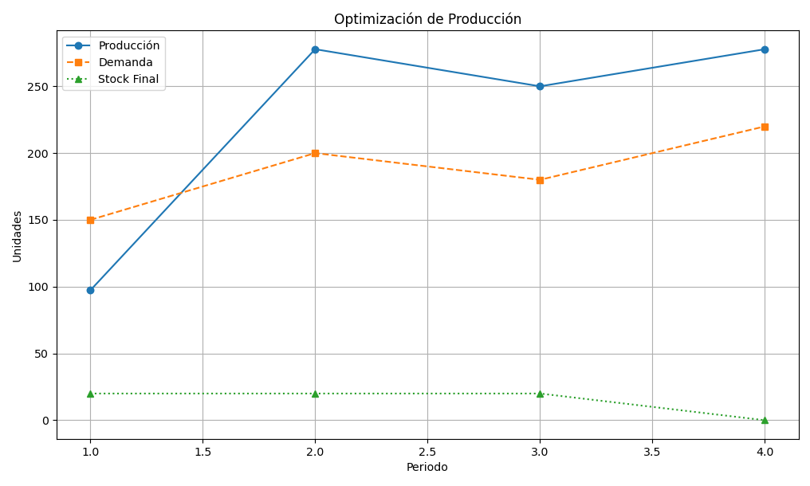

# 📊 Linealytics AutoProduction

Una solución integral y automatizada para la **planificación y optimización de la producción industrial**, desarrollada para el **Talen Hackaton 2025 Track Micron** por el equipo **Linealytics**.

### Objetivo Pricipal:

Crear un sistema con Python junto con el ecosistema empresarial de Microsoft, para automatizar los cálculos necesarios para equilibrar la producción con la demanda, permitiendo una planificación más precisa y eficiente y reduciendo los costes, mediante un modelo de XGBoost, Bootstrapping y un sistema de programación lineal.

###  Criterios Principales:

Optimizar el plan de producción mediante programación lineal para satisfacer la demanda minimizando la productividad,teniendo en cuenta el rendimiento, la densidad, el stock de seguridad y un stock objetivo final de cero.Args:initial_stock (float): El nivel de stock inicial.demands (lista de float): La demanda para cada periodo.yield_percentage (float): El porcentaje de rendimiento (0 a 1).density (float): El factor de densidad de producción.max_productivity (float): La productividad máxima por periodo.safety_stocks (lista de float, opcional): El stock de seguridad para cada periodo.Si None, no se aplica ninguna restricción de stock de seguridad.  Debe tener la misma longitud que las demandas si se proporciona.Devuelve:dict: La productividad total óptima.- 'production_levels': Una lista de los niveles óptimos de producción para cada período.- 'ending_stocks': Una lista de los niveles de existencias finales para cada período.- 'status': El estado de la optimización ('Óptimo', 'Inviable', etc.).

### 🚀 Características

- **Predicción precisa de demanda** semanal a través de modelos de Machine Learning.
- **Escenarios simulados** para gestionar la incertidumbre y evitar sobreproducción o escasez.
- **Planificación de producción óptima** semanal basada en restricciones reales.
- **Visualización en dashboards interactivos** para toma de decisiones ejecutiva.
- **Automatización completa del flujo de trabajo** desde la ingesta de datos hasta el envío de reportes.
- **Alertas automáticas** vía email sobre riesgos críticos.
- **Interacción por lenguaje natural** con Microsoft Copilot.

### ⚙️ Tecnologías Utilizadas

- **Frontend:** Power BI
- **Backend:** Python, XGBoost, Bootstrapping, Linear Programming
- **Infraestructura:** Microsoft Azure
- **Automatización:** Power Automate, Microsoft Copilot
- **Metodologías:** SCRUM + CRISP-DM

## Arquitectura

### Host:

Azure

### Data:

- 🎲 **Trasponer** 
- 🧮 **Conversion de trimestres a registros Semanales** 
- 🔍 **EDA**

### BackEnd:

- 🔍 **Predicción de demanda** con XGBoost
- 🎲 **Simulación de escenarios** con Bootstrapping
- 🧮 **Optimización de la producción** con Programación Lineal

### FrontEnd:

- ☁️ **Despliegue automatizado y visualización** con Microsoft Azure, Power BI y Power Automate

### Automatizacion con Microsoft Power Automate

- 📥 Ingesta de datos desde Excel
- 🔧 Transformación a CSV semanales
- 🤖 Modelos predictivos (XGBoost)
- 🎲 Simulaciones (Bootstrapping)
- 🧮 Optimización (Programación Lineal)
- 📊 Visualización (Power BI)
- 📧 Alertas automáticas (Power Automate)

### Notificaciones Via Mail.
Agregar Top Loss o un equivalencia para poder automatizar la notificacion en casos concretos como por ejemplo cuando el modelo detecte sobreproduccion o ruptura de Stock, Reportes semanales de PowerBI, etc. 

### Copilot:

Uso de lenguaje natural para usuarios finales, y que pueden hacer preguntas acerca de los data sets o exceles, PowerBI, etc

## Imagenes
# Visualización del Proyecto

Todas las imágenes a continuación están centradas para una mejor presentación visual del repositorio.

  
  
  
  
  
  
  
  
  
  
  
  
  
  
  
  
  
  
  
  

