# 📊 Linealytics AutoProduction

  

---

## 📌 Características Principales

Una solución integral y automatizada para la **planificación y optimización de la producción industrial**, desarrollada para el **Talen Hackaton 2025 - Track Micron** por el equipo **Linealytics**.

---

## 🎯 Objetivo Principal

Desarrollar un sistema con **Python** y el ecosistema empresarial de **Microsoft** para automatizar los cálculos necesarios que permitan equilibrar la producción con la demanda. Esto se logra mediante un modelo basado en **XGBoost**, **Bootstrapping** y **Programación Lineal**, asegurando:

- Planificación precisa y eficiente.
- Reducción de costos.
- Satisfacción de la demanda sin sobreproducción.

---

## 📌 Criterios de Optimización

Se busca **minimizar la productividad** necesaria para cumplir con la demanda, teniendo en cuenta:

- Stock inicial
- Rendimiento
- Densidad de producción
- Productividad máxima
- Stock de seguridad (opcional)
- Stock final objetivo: **cero**

El modelo devuelve:

- `production_levels`: Producción óptima semanal.
- `ending_stocks`: Inventario final por periodo.
- `status`: Resultado de la optimización (`Óptimo`, `Inviable`, etc.).

   
  <i>Programación Lineal</i>

  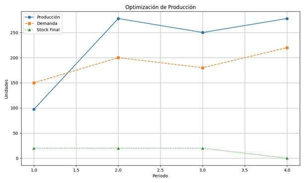 
  <i>Resultado del Modelo</i>

---

## 🚀 Características Clave

- 🧠 Predicción semanal de demanda con **Machine Learning**
- 🎲 Simulación de escenarios con **Bootstrapping**
- 🧮 Optimización con **Programación Lineal**
- 📈 Dashboards interactivos con **Power BI**
- ⚙️ Flujo de trabajo 100% automatizado
- 📧 Notificaciones automáticas por email
- 💬 Interacción con lenguaje natural vía **Microsoft Copilot**

   
  <i>Modelo XGBoost</i>

  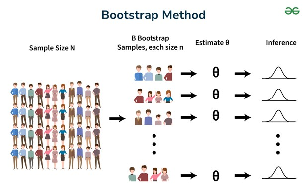 
  <i>Simulación Bootstrapping</i>

---

## ⚙️ Metodologías Utilizadas

SCRUM + CRISP-DM

  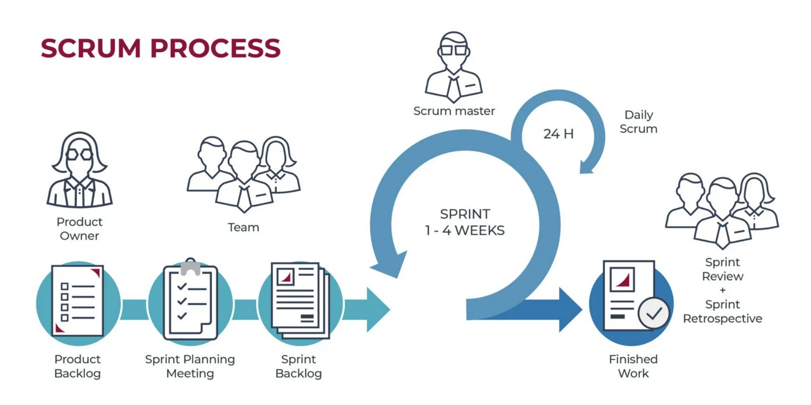 
  <i>SCRUM</i>

  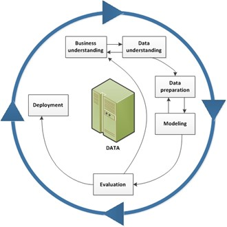 
  <i>CRISP-DM</i>

---

## ⚙️ Tecnologías Utilizadas

- **Frontend:** Power BI
- **Backend:** Python, XGBoost, Bootstrapping, Programación Lineal
- **Infraestructura:** Microsoft Azure
- **Automatización:** Power Automate, Microsoft Copilot

---

## 🏗️ Arquitectura General

  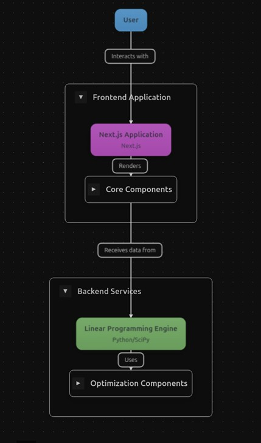 
  <i>Arquitectura del Sistema</i>

  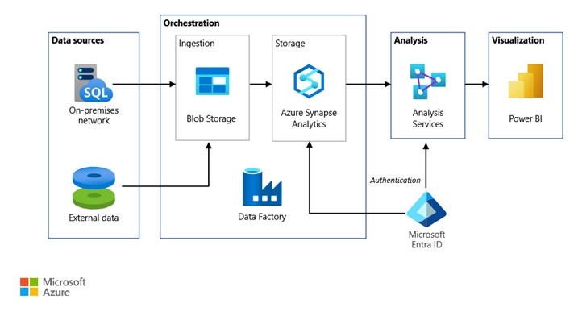 
  <i>Arquitectura en Azure</i>

  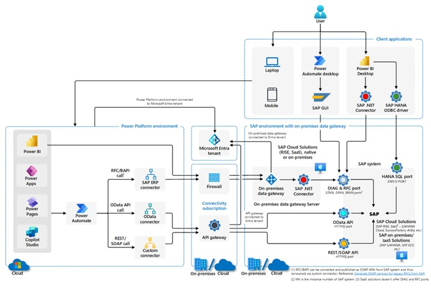 
  <i>Arquitectura en Azure + SAP</i>

---

## 🔁 Flujo de Trabajo Automatizado

**Microsoft Power Automate** permite:

- 📥 Ingesta de datos desde Excel
- 🔄 Conversión a registros semanales
- 🧠 Predicciones con XGBoost
- 🎲 Simulaciones
- 🧮 Optimización
- 📊 Visualización en Power BI
- 📧 Notificaciones por email

  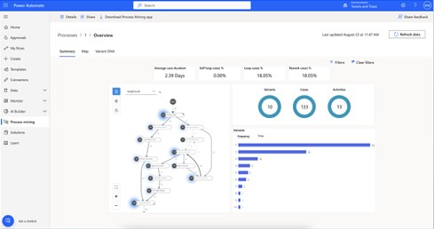 
  <i>Power Automate</i>

  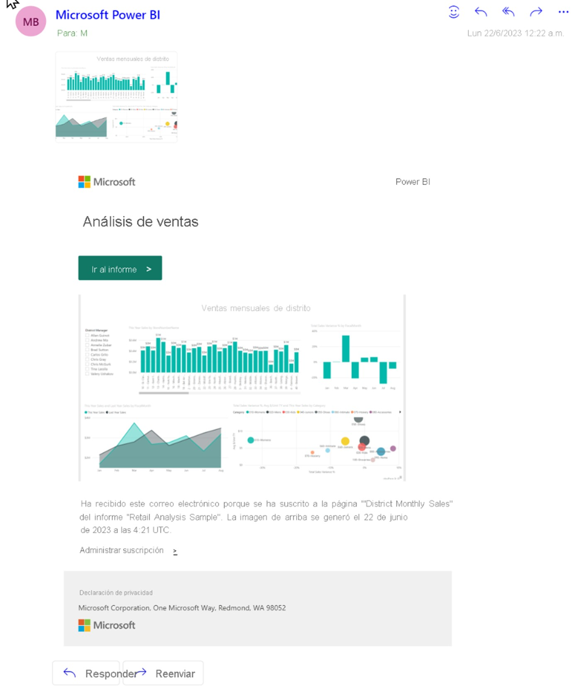
  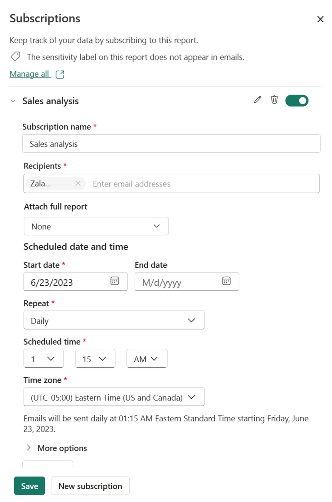
  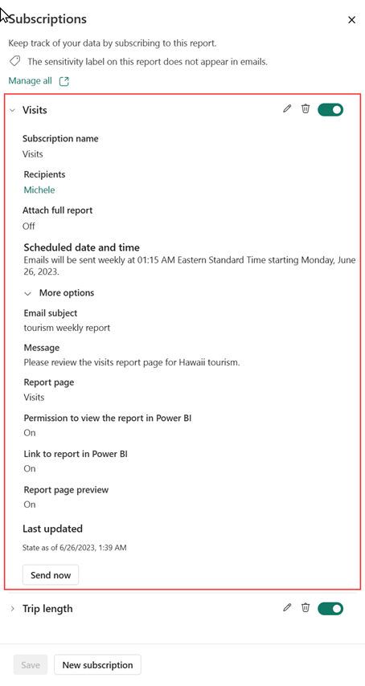
  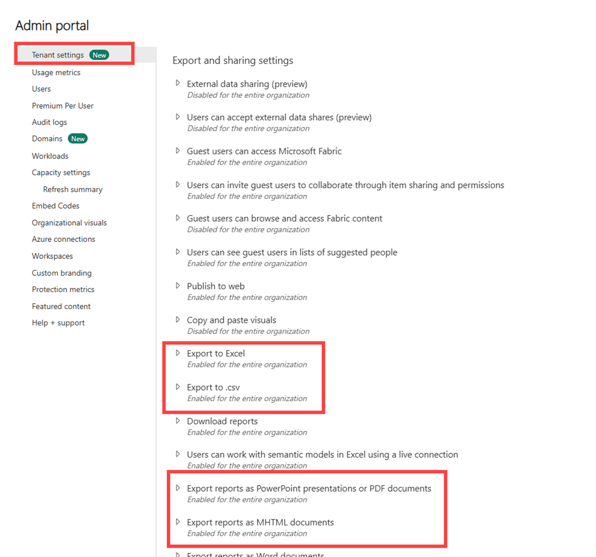
   <i>Alertas por Correo Automatizadas</i>

---

## 📊 Visualización y Análisis de Datos

Visualización clara de resultados para la toma de decisiones en **Power BI**.

  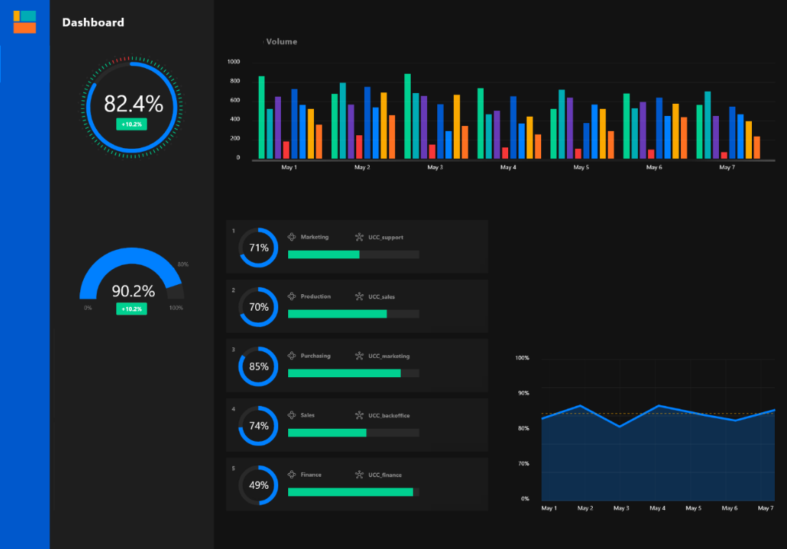
  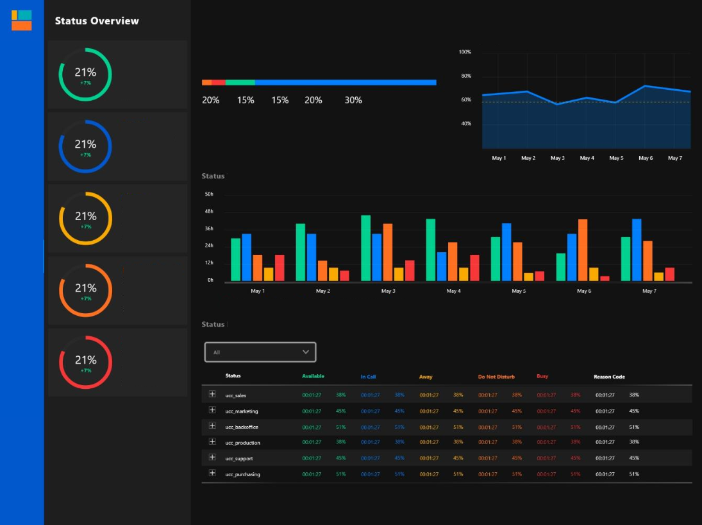
   <i>Dashboards en Power BI</i>

---

## 🔍 EDA y Preprocesamiento

- Exploración de datos.
- Conversión de trimestres a semanas.
- Transformaciones previas al modelado.

  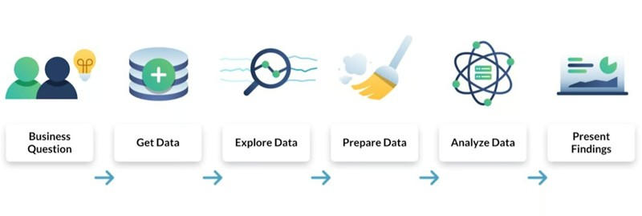
  
   <i>Análisis Exploratorio</i>

---

## 🗣️ Microsoft Copilot

Permite la **interacción por lenguaje natural** con los datos y dashboards:

- Consultas en lenguaje natural sobre Power BI, Excel, etc.
- Interacción accesible para usuarios no técnicos.

---

## 📬 Notificaciones Inteligentes

Se planea integrar un sistema de **alertas críticas** como:

- Ruptura de stock
- Sobreproducción
- Reportes semanales automatizados

Esto facilitará la acción temprana en situaciones de riesgo productivo.

---

## 📌 Conclusión

**Linealytics AutoProduction** transforma la planificación industrial al integrar inteligencia artificial, optimización matemática y automatización empresarial en una solución robusta, escalable y lista para entornos reales.

---
